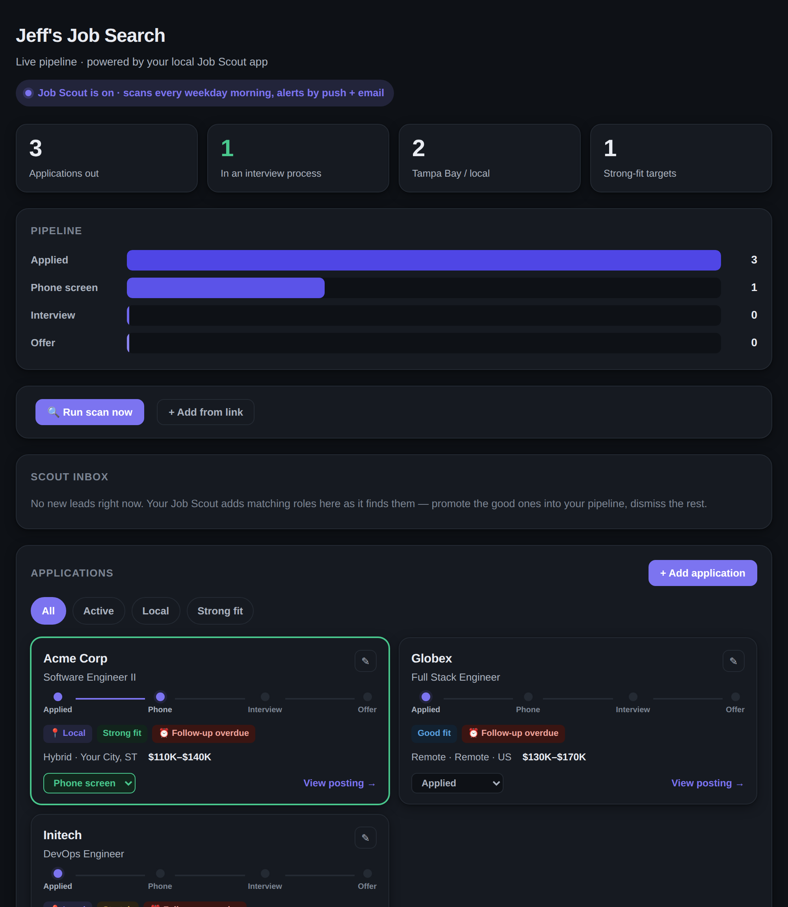

# Job Scout

A self-hosted job-search tracker with an optional AI assistant. Track applications
through a clean pipeline, and — if you want — let an AI agent scan job boards and
enrich pasted links for you, using **your own** Claude subscription (no API key).

Runs entirely on your machine with one `docker compose up`.



## Features

- **Pipeline dashboard** — applications as cards with a stage stepper
  (Applied → Phone → Interview → Offer), fit rating, salary, and follow-up flags.
- **Stats & funnel** — totals, active count, and a cumulative pipeline funnel.
- **Add / edit by hand** — a full form to manage roles; no database poking.
- **Scout inbox** — a place for discovered leads to review; apply on the posting,
  then file it with "Add from link", and dismiss the rest.
- **Optional AI buttons** — "Run scan now" and "Add from link", fulfilled by a
  local worker that drives Claude Code (your Pro/Max plan). No API key required.
- **MCP server** — expose the app to any MCP client so agents can add/update roles.

## Architecture

```
┌─────────────┐   REST/JSON    ┌──────────────┐    SQL    ┌────────────┐
│  React (UI) │ ─────────────▶ │  Django API  │ ────────▶ │ PostgreSQL │
│   (nginx)   │ ◀───────────── │    /api      │ ◀──────── │            │
└─────────────┘                └──────▲───────┘           └────────────┘
                                      │ same REST API
                           ┌──────────┴───────────┐
                           │  MCP server (stdio)  │ ◀── Claude Code / Desktop
                           └──────────▲───────────┘
                                      │ fulfills tasks
                           ┌──────────┴───────────┐
                           │  agent_worker.py     │ ◀── runs on the host,
                           │  (Claude Code)       │     drives your Max plan
                           └──────────────────────┘
```

## Quick start

Requires Docker Desktop.

```bash
git clone <your-fork-url> job-scout && cd job-scout
cp .env.example .env            # optional: set a secret, ports, sample data
docker compose up --build
```

Open **http://localhost:8080**. The API is at `http://localhost:8000/api`.

The database auto-migrates on boot and starts **empty** — add your own roles via
the UI. (Want demo data? Set `SEED_SAMPLE=1` in `.env` before first boot.)

### Configuration (`.env`)

| Variable | Purpose | Default |
|---|---|---|
| `DJANGO_SECRET_KEY` | Django secret | dev placeholder (change it) |
| `DATABASE_URL` | Postgres DSN | matches the `db` service |
| `BACKEND_PORT` | Host port for the API | `8000` |
| `FRONTEND_PORT` | Host port for the dashboard | `8080` |
| `SEED_SAMPLE` | Load generic sample data on boot | `0` |

If a port is already taken, change `BACKEND_PORT` / `FRONTEND_PORT` and rebuild.

## Optional: the AI assistant

The scan/enrich buttons are powered by **Claude Code** on your machine (your Pro or
Max subscription — no API key). Three one-time steps:

**1. Describe who you are.** Copy the profile template and edit it:

```bash
cp scout_profile.example.txt scout_profile.txt   # then edit (gitignored)
```

**2. Register the MCP server with Claude Code** (see `mcp-server/README.md`),
pointing it at your API, e.g. `JOBSCOUT_API_URL=http://localhost:8000/api`.

**3. Run the worker** from the project root and leave it running:

```bash
JOBSCOUT_API_URL=http://localhost:8000/api python3 agent_worker.py
```

Now the dashboard's **Run scan now** and **Add from link** buttons create tasks the
worker fulfills with Claude Code; results land in the Scout Inbox. The worker
pre-authorizes exactly the tools it needs, so it normally runs unattended. Only if
your setup still pauses for tool permission, restart it with `CLAUDE_DANGEROUS=1`
prepended (a last resort for a local, trusted worker).

### Optional: auto-scan every weekday morning (macOS)

Have the app fill its own inbox each weekday:

```bash
cp deploy/com.jobscout.morningscan.plist.example ~/Library/LaunchAgents/com.jobscout.morningscan.plist
# edit it: set __PROJECT_DIR__ to this folder and __API_URL__ to your API URL
launchctl load ~/Library/LaunchAgents/com.jobscout.morningscan.plist
```

It posts a scan task at 8:00 AM Mon–Fri; the running worker does the rest.

## Development (without Docker)

```bash
# backend
cd backend && pip install -r requirements.txt
DATABASE_URL="sqlite:///dev.sqlite3" DEBUG=True python manage.py migrate
DATABASE_URL="sqlite:///dev.sqlite3" DEBUG=True python manage.py runserver
# frontend
cd frontend && npm install && npm run dev   # http://localhost:5173
```

## Project layout

```
job-scout/
├── docker-compose.yml        one-command stack
├── backend/                  Django + DRF API
│   ├── config/               settings / urls
│   └── applications/         models, serializers, views, services, sample seed
├── frontend/                 React (Vite) dashboard
│   └── src/components/        tiles, funnel, cards, form, inbox, agent controls
├── mcp-server/               stdio MCP server (API-first wrapper)
├── agent_worker.py           host worker that runs Claude Code for scan/enrich
├── scripts/ · deploy/        morning auto-scan helper + launchd template
└── scout_profile.example.txt profile template (copy to scout_profile.txt)
```

## Privacy

Your data lives only in your local Postgres volume. `scout_profile.txt`, `.env`,
and any `*.zip` are gitignored, so your profile, secrets, and exports never enter
version control. The committed seed data is fictional placeholder data.

## License

MIT — do whatever you like; no warranty.
